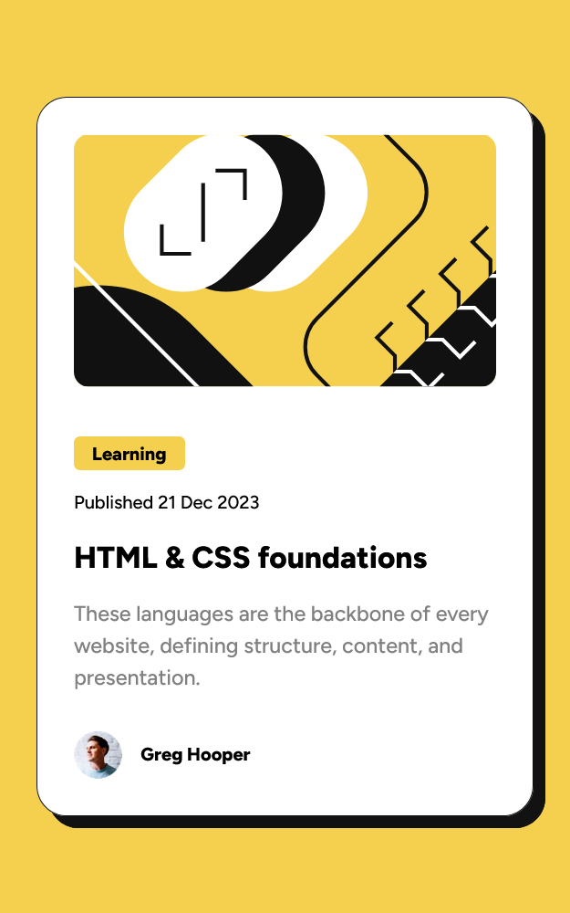
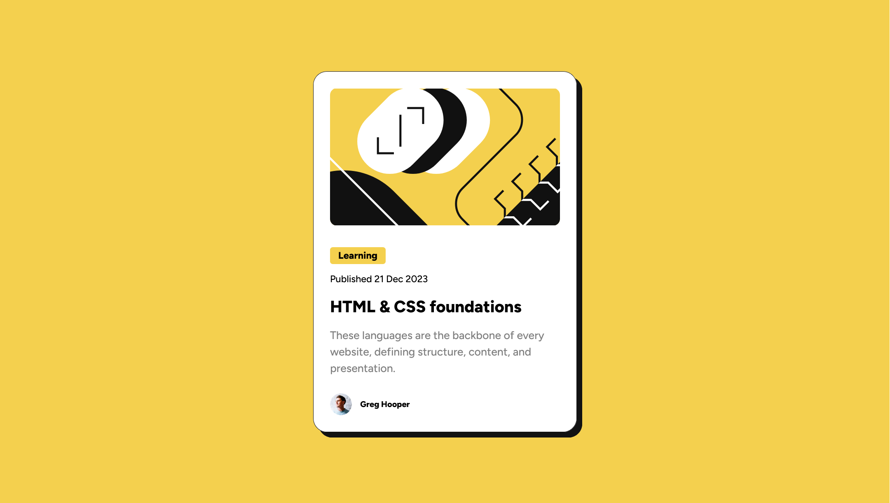

# Frontend Mentor - Blog preview card solution

This is a solution to the [Blog preview card challenge on Frontend Mentor](https://www.frontendmentor.io/challenges/blog-preview-card-ckPaj01IcS). 

## Table of contents

- [Overview](#overview)
  - [The challenge](#the-challenge)
  - [Screenshot](#screenshot)
  - [Links](#links)
- [Author](#author)

## Overview

### The challenge

Just a simple challenge to get used to using CSS again after a break. 

### Screenshot

### Links
0
- Solution URL: [https://www.frontendmentor.io/solutions/blog-preview-card-hiSAJoxA3v](https://www.frontendmentor.io/solutions/blog-preview-card-hiSAJoxA3v)
- Live Site URL: [https://blog-preview-card-sable-pi.vercel.app/](https://blog-preview-card-sable-pi.vercel.app/)

## Author

- Frontend Mentor - [@TomL](https://www.frontendmentor.io/profile/TomL)
- GitHub - [@TomL](https://github.com/toml)
